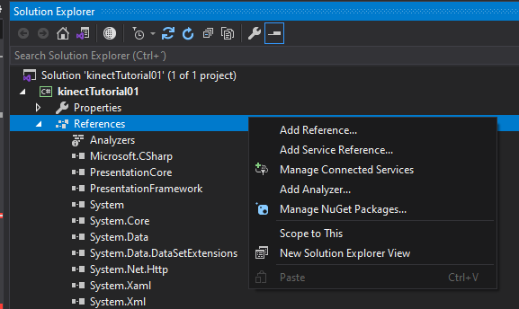
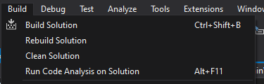
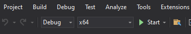
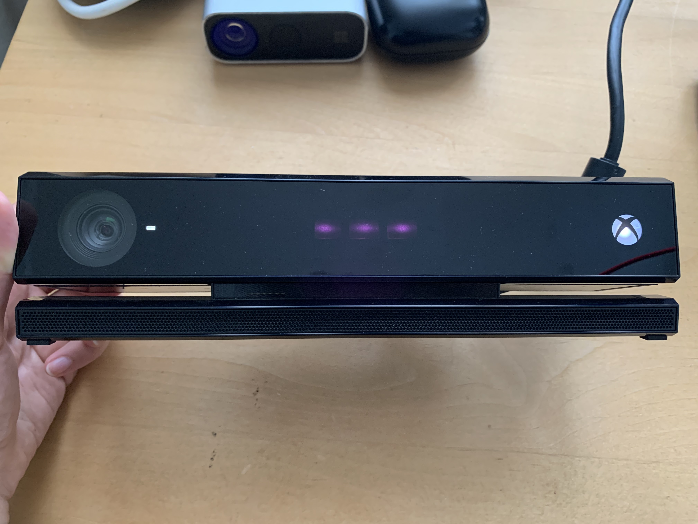

# Tutorial 1: Opening Kinect V2 camera

In this tutorial, you will be able to get access to the camera. At the end you will have the lights of your device turned on.

### Prerequisites

You must have already followed the guide for installing and configuring the Kinect V2 [Link](https://github.com/violetasdev/bodytrackingdepth_course/wiki/Kinect-V2)

You must have configured your Visual Studio 2019 correctly as instructed [Link](https://github.com/violetasdev/bodytrackingdepth_course/blob/master/KinectV2/docs/visualStudio2019_doc.md)


### Adding the Microsoft Kinect Library to the project

1. Add the __Microsoft Kinect V2__ extension to your project. On the __Solution Explorer__, right click on __References__



2. In the __Assemblies__ section, search for __Microsoft.Kinect__. Check/select the extension and ___Save___.


3. You are now able to see the extension active in your __Solution Explorer__


4. For the code to be able to use the extension, you must declare it in your ___MainWindow.xaml.cs__ file:

```
... 

using System.Windows.Media.Imaging;
using System.Windows.Navigation;
using System.Windows.Shapes;

/// Kinect Libraries
using Microsoft.Kinect;

namespace kinectTutorial01
{
    /// <summary>
    /// Interaction logic for MainWindow.xaml
    /// </summary>
    public partial class MainWindow : Window

...
```

### Opening the camera

1. Create a __KinectSensor__ Object from the __Microsoft.Kinect__ library
```
private KinectSensor kinectSensor = null;
```

2. In the Main class, call the Kinect device with the method __GetDefault()__
```
// Initialize the sensor
            kinectSensor = KinectSensor.GetDefault();
```

3. Open your sensor with the method, __Open()__
```
// Open the sensor
            kinectSensor.Open();
```

4. Save all
5. Build your solution by clicking on __Build Solution__



6. Run your solution by clicking on __Start__



7. You should be able to see the lights of your sensor on!



8. The final code should look like this:

```
// other libraries from your template
....

// Kinect V2 Extensions
using Microsoft.Kinect;

/***
Body Tracking with depth sensor course SS2021
Kinect Tutorial 01: Access the sensor

Goal: Get access to the Kinect by adding the libraries
Result: An empty Window and the Kinect V2 lights on. We still havent call the feed into the interface!
**/
namespace kinectTutorial01
{
    /// <summary>
    /// Interaction logic for MainWindow.xaml
    /// </summary>
    public partial class MainWindow : Window
    {
        // Create the Kinect sensor object
        private KinectSensor kinectSensor = null;
        public MainWindow()
        {
            // Initialize the sensor
            kinectSensor = KinectSensor.GetDefault();
            // Open the sensor
            kinectSensor.Open();
            InitializeComponent();
        }
    }
}

```
9. Now you are able to open your Kinect sensor.