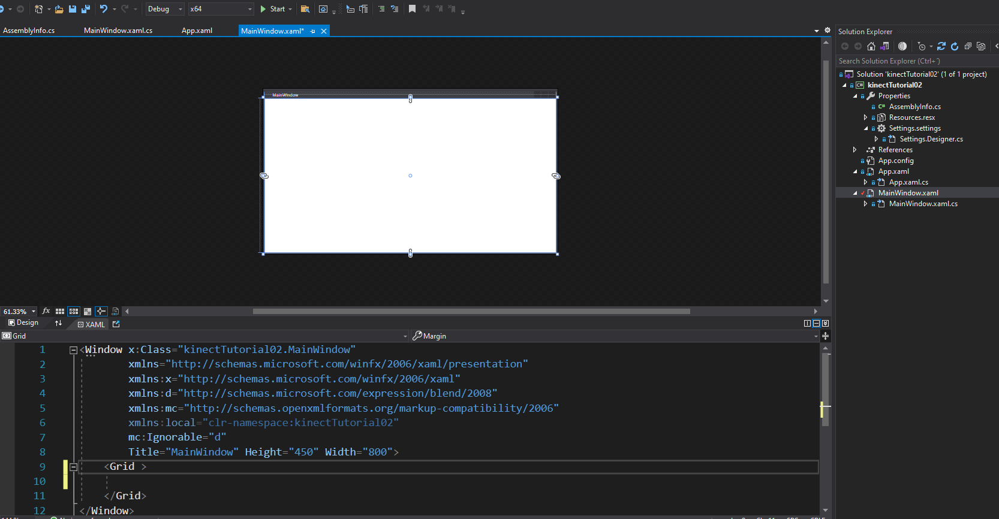
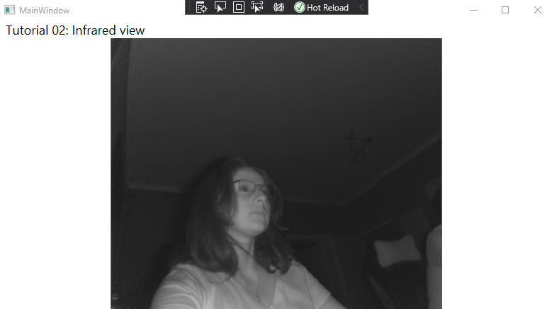

# Tutorial 2: Infrared frames

In this tutorial, you will be able to get access to infrared data. Once you run the code, you will have a window displaying the feed of your camera.

__Our goal:__ Every frame that we receive arrives as ___infrarred data___ for every pixel of the camera resolution. We need to transform this to a grayscale color range in a dataset. Once converted, we will transfer the data set to create a visible image in our interface. 

## Prerequisites

* You must have already followed the guide for installing and configuring the Kinect V2 [Link](https://github.com/violetasdev/bodytrackingdepth_course/wiki/Kinect-V2)

* You must have configured your Visual Studio 2019 correctly as instructed [Link](https://github.com/violetasdev/bodytrackingdepth_course/blob/master/KinectV2/docs/visualStudio2019_doc.md)

* You already know the general details of opening the camera. Check the [Tutorial 01](https://github.com/violetasdev/bodytrackingdepth_course/blob/master/KinectV2/docs/kinectTutorial01_doc.md) as this is the template we are following.

## Setting up the Infrared feed

Before opening the camera, we need to code and declare the events and variables to retrieve the infrared frames.

__Important objects__: To handle all the infrared frame data, we will need the following variables:

- ___infraredFrameReader___: reader for infrared frames
- ___infraredFrameData___: storage to receive the frame data from the sensor
- ___infraredPixels___: storage of the converted frames to color pixels for display
- ___bitmap___: image object in which we transfer the converted frames to show in our XAML interface

Now that we understand our goal and the main variables, let's start coding the solution:

1. In the ___class MainWindow__ from your code file, ___MainWindow.XAML.cs___, declare the variables for retrieving the information:

```C#
... 
 /// Kinect Sensor
        private KinectSensor kinectSensor = null;
       
        /** INFRARED FRAME**/
        /// Reader for infrared frames
        private InfraredFrameReader infraredFrameReader = null;
        /// Description (width, height, etc) of the infrared frame data
        private FrameDescription infraredFrameDescription = null;
        /// Bitmap to display
        private WriteableBitmap bitmap = null;
```

2. Now, to process the incoming infrared frames, we must set up the limits for rendering the infrared data. This will help us translate the information into a readable human eyes image by configuring the intensity values.

```C#
...
       /** Scale the values from 0 to 255 **/

        /// Setup the limits (post processing)of the infrared data that we will render.
        /// Increasing or decreasing this value sets a brightness "wall" either closer or further away.
        private const float InfraredOutputValueMinimum = 0.01f;
        private const float InfraredOutputValueMaximum = 1.0f;
        private const float InfraredSourceValueMaximum = ushort.MaxValue;
        /// Scale of Infrared source data
        private const float InfraredSourceScale = 0.75f;
```

3. For displaying the data in our interface, we need to create the object __Image Source__. Once it is called, it will show the values in the ___bit map__ object created in step 1.

```C#
...
          // open the sensor
            this.kinectSensor.Open();

            InitializeComponent();
        }

        public ImageSource ImageSource
        {
            get
            {
                return this.bitmap;
            }
```

4. Now that we have our objects to store the sensor's data and show our final results, it is time to process the data. The main logic goes into the __MainWindow()__ function, which currently looks like this:

```C#
        public MainWindow()
        {
            // Initialize the sensor
            this.kinectSensor = KinectSensor.GetDefault();

            // open the sensor
            this.kinectSensor.Open();

            InitializeComponent();
        }
```


5. To receive the infrared data, we need to open the reader for the depth frames:

```C#
...
public MainWindow()
        {
            // Initialize the sensor
            this.kinectSensor = KinectSensor.GetDefault();

            // open the reader for the depth frames
            this.infraredFrameReader = kinectSensor.InfraredFrameSource.OpenReader();
...

```

6.  With the reader open, we will start getting one by one the frames of the scene in which the camera is placed. This data will be stored in memory in the Kinect's buffer. We can read the shape of the data already and verify whether the size of the information is valid to display. If it is correct, then we storage the frame in a data object:

```C#
     private void Reader_InfraredFrameArrived(object sender, InfraredFrameArrivedEventArgs e)
        {
           
            // InfraredFrame is IDisposable
            using (InfraredFrame infraredFrame =e.FrameReference.AcquireFrame())
            {
                if (infraredFrame != null)
                {
                    /// We are using WPF (Windows Presentation Foundation)
                    using (Microsoft.Kinect.KinectBuffer infraredBuffer = infraredFrame.LockImageBuffer())
                    {
                        // verify data and write the new infrared frame data to the display bitmap
                        if (((this.infraredFrameDescription.Width * this.infraredFrameDescription.Height) == (infraredBuffer.Size / this.infraredFrameDescription.BytesPerPixel)) &&
                            (this.infraredFrameDescription.Width == this.bitmap.PixelWidth) && (this.infraredFrameDescription.Height == this.bitmap.PixelHeight))
                        {
                            this.ProcessInfraredFrameData(infraredBuffer.UnderlyingBuffer, infraredBuffer.Size);
                        }
                    }
                }
            }

        }
```

7. You might notice a warning in the code about the __ProcessInfraredFrameData__ method, which is still undefined. This method allows us to access the image buffer mentioned in the previous step and organize the information inside or __bitmap__ object to be displayed. 

First, we lock the image to prevent external access to it. Secondly, we normalize the pixels retrieved to greyscale for each valid frame with the constant values we declared for the intensity. Then, we draw the rectangle shape in which the newly converted pixels exist. Finally, we release the __bitmap__ object for our program to have access to it later. 

___Note___ : remember to activate your __unsafe__ code in the __Build properties__ for your project!

```C#
  /// Directly accesses the underlying image buffer of the InfraredFrame to create a displayable bitmap.
        /// This function requires the /unsafe compiler option as we make use of direct access to the native memory pointed to by the infraredFrameData pointer.
        /// Activate "unsafe" in the solution properties > on the left >Build > Check Allow unsafe code
        /// <param name="infraredFrameData">Pointer to the InfraredFrame image data</param>
        /// <param name="infraredFrameDataSize">Size of the InfraredFrame image data</param>
private unsafe void ProcessInfraredFrameData(IntPtr infraredFrameData, uint infraredFrameDataSize)
        {
            // infrared frame data is a 16 bit value
            ushort* frameData = (ushort*)infraredFrameData;

            // lock the target bitmap
            this.bitmap.Lock();

            // get the pointer to the bitmap's back buffer
            float* backBuffer = (float*)this.bitmap.BackBuffer;

            // process the infrared data
            for (int i = 0; i < (int)(infraredFrameDataSize / this.infraredFrameDescription.BytesPerPixel); ++i)
            {
                // since we are displaying the image as a normalized grey scale image, we need to convert from
                // the ushort data (as provided by the InfraredFrame) to a value from [InfraredOutputValueMinimum, InfraredOutputValueMaximum]
                backBuffer[i] = Math.Min(InfraredOutputValueMaximum, (((float)frameData[i] / InfraredSourceValueMaximum * InfraredSourceScale) * (1.0f - InfraredOutputValueMinimum)) + InfraredOutputValueMinimum);
            }

            // mark the entire bitmap as needing to be drawn
            this.bitmap.AddDirtyRect(new Int32Rect(0, 0, this.bitmap.PixelWidth, this.bitmap.PixelHeight));

            // unlock the bitmap
            this.bitmap.Unlock();
        }
```

8. Now, we will configure the interface to display the image we created. Open your interface file by clicking in ___MainWindow.XAML.cs___. You will see a Windows 10 type form with the XAML code below. XAML is a markup language, so you need to properly close the tags to make it work. 



9. The project already comes with the basic template. We will add elements inside the __Grid__ tag. A grid is composed of rows and columns. So we will define the following tags:

* __Grid.RowDefinitions__: for controlling the resizing
* __TextBlock__: control to display text. We will add the title of our tutorial to inform others what are we displaying
* __ViewBox__: 
* __Image__: control to make reference to the __ImageSource__ defined to recall the __bitmap__ object. We use the Binding property as it helps us to interact with data establishing a connection between our source code and our UI (interface). 

```XML
<Grid Margin="10 0 10 0">
        <Grid.RowDefinitions>
            <RowDefinition Height="Auto" />
            <RowDefinition Height="*" />
            <RowDefinition Height="Auto" />
            <RowDefinition Height="Auto" />
        </Grid.RowDefinitions>
        <TextBlock Grid.Row="0" Margin="0 0 -1 0" HorizontalAlignment="Left" VerticalAlignment="Bottom" FontFamily="Segoe UI" FontSize="18">Tutorial 02: Infrared view</TextBlock>
        <Viewbox Grid.Row="1" HorizontalAlignment="Center">
            <Image Source="{Binding ImageSource}" Stretch="UniformToFill" />
        </Viewbox>
    </Grid>
```


10. Save everything. Now, Build and Run your code. Click on the green play button to start. You should get a result like this:



11. Congratulations! You finished Tutorial 02. 