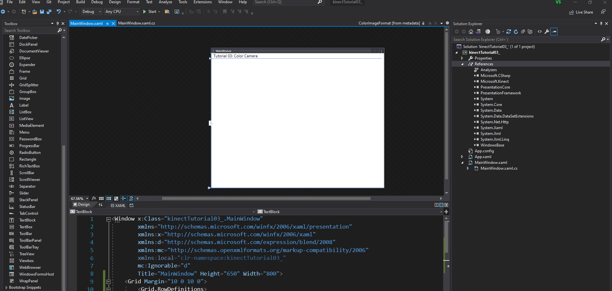
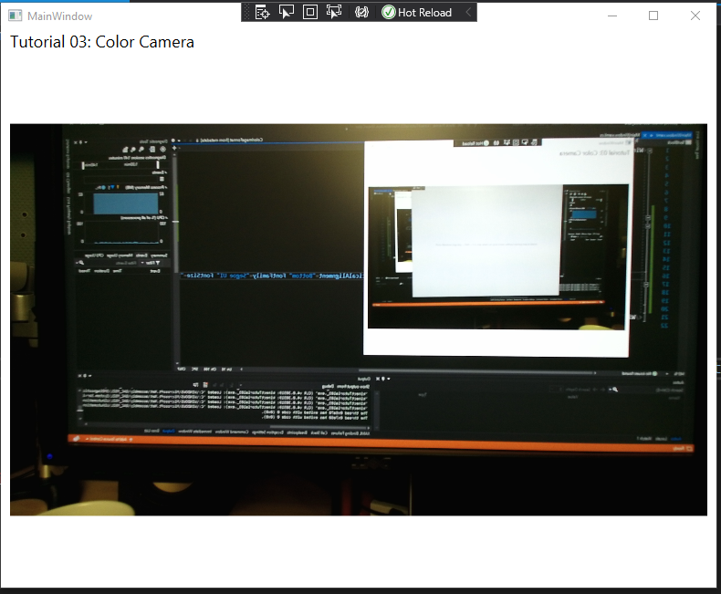

# Tutorial 3: Color camera

In this tutorial, you will be able to create an interactive interface to get access to all properties of the camera feed. Once you run the code, you will have a window displaying a frame source, and three buttons to change in between them.

__Our goal:__ We will learn how to access events in the interface and to manage different frame sources from our depth cameras. 

## Prerequisites

* You must have already followed the guide for installing and configuring the Kinect V2 [Link](https://github.com/violetasdev/bodytrackingdepth_course/wiki/Kinect-V2)

* You must have configured your Visual Studio 2019 correctly as instructed [Link](https://github.com/violetasdev/bodytrackingdepth_course/blob/master/KinectV2/docs/visualStudio2019_doc.md)

* You already know the general details of opening the camera. Check the [Tutorial 01](https://github.com/violetasdev/bodytrackingdepth_course/blob/master/KinectV2/docs/kinectTutorial01_doc.md) as this is the template we are following.

## Setting up depth feed

Before opening the camera, we need to code and declare the events and variables to retrieve the color frames.

__Important objects__: To handle all the color frames data, we will need the following variables:

- ___colorFrameReader___: reader for the color frames
- ___colorFrameDescription___: component with properties of the color data such as the size of the image.
- ___bitmap___: image object in which we transfer the converted frames to show in our XAML interface


Now that we understand our goal and the main variables, let's start coding the solution:

1. Include the Kinect library in your source code:

```C#
...  
 /// Kinect Libraries
using Microsoft.Kinect;
```

2. In the ___class MainWindow__ from your code file, ___MainWindow.XAML.cs___, declare the variables for retrieving the information:

```C#
... 
 /// Kinect Sensor
        // Kinect Sensor
        private KinectSensor kinectSensor = null;
        //Reader for the Color information
        private ColorFrameReader colorFrameReader = null;
        // Object to write the image to show on the interface
        private WriteableBitmap bitmap = null;
```

3. For displaying the data in our interface, we need to create the object __Image Source__. Once it is called, it will show the values in the ___bit map__ object created in step 1.

```C#
...
          // open the sensor
            this.kinectSensor.Open();

            InitializeComponent();
        }

        public ImageSource ImageSource
        {
            get
            {
                return this.bitmap;
            }
```

4. Now that we have our objects to store the sensor's data and show our final results, it is time to process the data. The main logic goes into the __MainWindow()__ function, which currently looks like this:

```C#
        public MainWindow()
        {
            // Initialize the sensor
            this.kinectSensor = KinectSensor.GetDefault();

            // open the sensor
            this.kinectSensor.Open();

            InitializeComponent();
        }
```

5. To receive the color data from the camera, we need to open the __color frame source_ reader to start receiving the color frames:

```C#
...
public MainWindow()
        {
            // get the kinectSensor object
            this.kinectSensor = KinectSensor.GetDefault();

            // open the reader for the color frames
            this.colorFrameReader = this.kinectSensor.ColorFrameSource.OpenReader();

            // wire handler for frame arrival
            this.colorFrameReader.FrameArrived += this.Reader_ColorFrameArrived;
...

```

6.  With the reader open, we will start getting one by one the frames of the scene in which the camera is placed. To process the data, we use the method __Reader_ColorFrameArrived__, which allows us to verify the data and create an image in a BGRA format, representing 4 bytes per pixel to Blue, Green, Red, and Alpha colors.

We lock the object __bitmap__ to prevent changes while we write the information required to display the camera feed. Once the frames are converted and the vertices of the image's rectangle defined with the properties from __FrameDescription__, the bitmap object is rereleased:

```C#
     private void Reader_ColorFrameArrived(object sender, ColorFrameArrivedEventArgs e)
        {
            using (ColorFrame colorFrame = e.FrameReference.AcquireFrame())
            {
                if (colorFrame != null)
                {
                    FrameDescription colorFrameDescription = colorFrame.FrameDescription;

                    using (KinectBuffer colorBuffer = colorFrame.LockRawImageBuffer())
                    {
                        this.bitmap.Lock();

                        // verify data and write the new color frame data to the display bitmap
                        if ((colorFrameDescription.Width == this.bitmap.PixelWidth) && (colorFrameDescription.Height == this.bitmap.PixelHeight))
                        {
                            colorFrame.CopyConvertedFrameDataToIntPtr(
                                this.bitmap.BackBuffer,
                                (uint)(colorFrameDescription.Width * colorFrameDescription.Height * 4),
                                ColorImageFormat.Bgra);

                            this.bitmap.AddDirtyRect(new Int32Rect(0, 0, this.bitmap.PixelWidth, this.bitmap.PixelHeight));
                        }

                        this.bitmap.Unlock();
                    }
                }
            }
        }
```

7. The next step is to conclude the code of the __MainWindow__ method. After defining the arrival of the frames, we should recover the information from the camera feed located in the __FrameDescription__ to create the bitmap object based on the measured Width and Height. Lastly, we define the __DataContext__. Without it, we won't communicate the data collected to the UI (interface). 

```C#
  // create the colorFrameDescription from the ColorFrameSource using Bgra format
            FrameDescription colorFrameDescription = this.kinectSensor.ColorFrameSource.CreateFrameDescription(ColorImageFormat.Bgra);

            // create the bitmap to display
            this.bitmap= new WriteableBitmap(colorFrameDescription.Width, colorFrameDescription.Height, 96.0, 96.0, PixelFormats.Bgr32, null);

           // use the window object as the view model in this simple example
            this.DataContext = this;
            // open the sensor
            this.kinectSensor.Open();

            InitializeComponent();
        }
```

8. Now, we will configure the interface to display the image we created. Open your interface file by clicking in ___MainWindow.XAML.cs___. You will see a Windows 10 type form with the XAML code below. XAML is a markup language, so you need to properly close the tags to make it work. 



9. The project already comes with the basic template. We will add elements inside the __Grid__ tag. A grid is composed of rows and columns. So we will define the following tags:

* __Grid.RowDefinitions__: for controlling the resizing
* __TextBlock__: control to display text. We will add the title of our tutorial to inform others what are we displaying
* __ViewBox__: 
* __Image__: control to make reference to the __ImageSource__ defined to recall the __bitmap__ object. We use the Binding property as it helps us to interact with data establishing a connection between our source code and our UI (interface). 

```XML
<Grid Margin="10 0 10 0">
        <Grid.RowDefinitions>
            <RowDefinition Height="Auto" />
            <RowDefinition Height="*" />
            <RowDefinition Height="Auto" />
            <RowDefinition Height="Auto" />
        </Grid.RowDefinitions>
        <TextBlock Grid.Row="0" Margin="0 0 -1 0" HorizontalAlignment="Left" VerticalAlignment="Bottom" FontFamily="Segoe UI" FontSize="18">Tutorial 03: Color Camera</TextBlock>
        <Viewbox Grid.Row="1" HorizontalAlignment="Center">
            <Image Source="{Binding ImageSource}" Stretch="UniformToFill" />
        </Viewbox>
    </Grid>
```


10. Save everything. Now, Build and Run your code. Click on the green play button to start. You should get a result like this:



11. Congratulations! You finished Tutorial 03. Check the complete source code in the repository for a comprehensive overview [Link](https://github.com/violetasdev/bodytrackingdepth_course/tree/master/KinectV2/kinectTutorial03_)