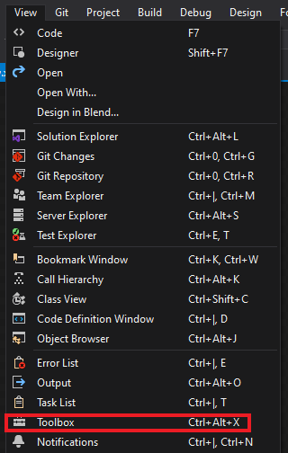

# Tutorial 4: Multiple Frame Source

In this tutorial, you will get access to three frame sources and select the desired one by clicking a button. 

__Our goal:__ 

## Prerequisites

* You must have already followed the guide for installing and configuring the Kinect V2 [Link](https://github.com/violetasdev/bodytrackingdepth_course/wiki/Kinect-V2)

* You must have configured your Visual Studio 2019 correctly as instructed [Link](https://github.com/violetasdev/bodytrackingdepth_course/blob/master/KinectV2/docs/visualStudio2019_doc.md)

* You already know the general details of opening the camera. Check the [Tutorial 01](https://github.com/violetasdev/bodytrackingdepth_course/blob/master/KinectV2/docs/kinectTutorial01_doc.md) as this is the template we are following.

* You have finished tutorials 00 to 03. Check the [Tutorials Documentations](https://github.com/violetasdev/bodytrackingdepth_course/blob/master/KinectV2/docs/) as this is the template we are following.

## Setting up the camera source variables

Before opening the camera, we need to understand the events and variables to retrieve the depth frames.

__Important objects__: To handle the different frames data sources, we will need the following variables:

- ___displayFrameType___: definition of the frame source to be handled by the event notifier
- ___currentFrameDescription___: object with the properties of the frame source selected by the user
- ___currentDisplayFrameType___: object with the value of the selected or default __displayFrameType__
- ___multiSourceFrameReader___:  reader for the select frame source
- ___bitmap___: image object in which we transfer the converted frames to show in our XAML interface

Now that we understand our goal and the main variables, let's start coding the solution:

1. Include the Kinect and event handle libraries in your source code:

```C#
...  
using System.ComponentModel;
 /// Kinect Libraries
using Microsoft.Kinect;
```

2. Now, we need to create a class containing the available frame types. We will be using the ___Infrared, Color___ and ___Depth___ streams.

```C#
...

namespace kinectTutorial04
{
    public enum DisplayFrameType
    {
        Infrared,
        Color,
        Depth
    }

...
```
3. In the __class MainWindow__ from your code file, ___MainWindow.XAML.cs___, we need to add a notification property to the class to manage the Clic Button events. Once we press the button, we are selecting a different source type and changing __currentFrameDescription__, and we need to inform from this to the program:

```C#
... 
public partial class MainWindow : Window, INotifyPropertyChanged
    {
```
 
4. Now, inside the ___class MainWindow__ declare the variables for retrieving the information. The variables are similar to those in Tutorials 02 and 03 for retrieving infrared and color data. Now that we will manage different types, we need a global object that will change the data retrieved according to the __currentFrameDescription__.

We assign as the default source to display with the __DEFAULT_DISPLAYFRAMETYPE__. 
```C#
public partial class MainWindow : Window, INotifyPropertyChanged
    {
        // Setup interface option selection
        private const DisplayFrameType DEFAULT_DISPLAYFRAMETYPE = DisplayFrameType.Depth;

        /// Kinect Sensor
        private KinectSensor kinectSensor = null;

        // Object to write the image to show on the interface
        private WriteableBitmap bitmap = null;
        private FrameDescription currentFrameDescription;
        private DisplayFrameType currentDisplayFrameType;
        // Reader to receive the information from the camera
        private MultiSourceFrameReader multiSourceFrameReader = null;
```

Additionally, after your __public MainWindow()__, create the EventHandler. This object does not have any other code lines as the compiler will take care of it. The EventHandler help us to notify the main programm about the changes of the selected source frame that relies on the __CurrentFrameDescription__ variable:

```C#
public MainWindow()
        {
            .....
        }

        public event PropertyChangedEventHandler PropertyChanged;

        public FrameDescription CurrentFrameDescription
        {
            get { return this.currentFrameDescription; }
            set
            {
                if (this.currentFrameDescription != value)
                {
                    this.currentFrameDescription = value;
                    if (this.PropertyChanged != null)
                    {
                        this.PropertyChanged(this, new PropertyChangedEventArgs("CurrentFrameDescription"));
                    }
                }
            }
        }
```

5. As we are processing this time also depth information, we need to define the range of the __map depth__ and the data structure to store the values:

```C#
        /** Scale values for depth input**/
        /// Map depth range to byte range
        private const int MapDepthToByte = 8000 / 256;
        /// Intermediate storage for frame data converted to color
        private byte[] depthPixels = null;
```

6. In the __MainWindow()__ method, we retrieve the information sent by the sensor, using similar methods as before. The change is in using the __SetupCurrentDisplay()__ method, which will configure the frame descriptions and the image that we will need to create as an output. 

___Note:___ Have a look at tutorials 02 and 03 and review how we abstract the initialization of the frame reader from a single to a global strategy.

```C#
public MainWindow()
        {
            // Set up display frame types:
            // 1. get FrameDescription
            // 2. create the bitmap to display
            SetupCurrentDisplay(DEFAULT_DISPLAYFRAMETYPE);

            // Initialize the sensor
            this.kinectSensor = KinectSensor.GetDefault();
            // open the reader for the  frames, this time it is a global object with 3 options: Infrared, Color and Depth:
            this.multiSourceFrameReader = this.kinectSensor.OpenMultiSourceFrameReader(FrameSourceTypes.Infrared | FrameSourceTypes.Color | FrameSourceTypes.Depth);
            // Handler for frame arrival according to the frame source - This is a defined method
            this.multiSourceFrameReader.MultiSourceFrameArrived += this.Reader_MultiSourceFrameArrived;

            // use the window object as the view model in this simple example
            this.DataContext = this;
            // open the sensor
            this.kinectSensor.Open();

            InitializeComponent();
        }
```

As we did in previous Tutorials, remember to create the __ImageSource__ object for displaying your data:

```C#

public MainWindow()
        {
            ....
        }

        ....
        
        public ImageSource ImageSource
        {
            get
            {
                return this.bitmap;
            }
        }

```
6. We have to create now the method __SetupcurrentDisplay__. This method will be fired on every button click, receiving an argument the __DisplayFrameType__. According to the value, which we will evaluate with a ___switch case___, it will create the objects necessary to process Infrared, Color, or Depth data.

Notice that the general structure is the same for all the sources. The main difference is in the definition of the __Pixel Format__ as each type needs to be transformed in different sizes and format of pixels:

```C#
      private void SetupCurrentDisplay(DisplayFrameType newDisplayFrameType)
        {
            currentDisplayFrameType = newDisplayFrameType;
            // The console write line will let you know if clicking the button is doing something. You can uncommented and check in the console while running the programm wich variable are you sending:
            //Console.WriteLine(currentDisplayFrameType);
            switch (currentDisplayFrameType)

            {
                case DisplayFrameType.Infrared:
                    FrameDescription infraredFrameDescription = this.kinectSensor.InfraredFrameSource.FrameDescription;
                    this.CurrentFrameDescription = infraredFrameDescription;
                    // allocate space to put the pixels being       // received and converted
                    this.bitmap = new WriteableBitmap(infraredFrameDescription.Width, infraredFrameDescription.Height, 96.0, 96.0, PixelFormats.Gray32Float, null);
                    break;

                case DisplayFrameType.Color:
                    FrameDescription colorFrameDescription = this.kinectSensor.ColorFrameSource.FrameDescription;
                    this.CurrentFrameDescription = colorFrameDescription;
                    // create the bitmap to display
                    this.bitmap = new WriteableBitmap(colorFrameDescription.Width, colorFrameDescription.Height, 96.0, 96.0, PixelFormats.Bgra32, null);
                    break;

                case DisplayFrameType.Depth:
                    FrameDescription depthFrameDescription = this.kinectSensor.DepthFrameSource.FrameDescription;
                    this.CurrentFrameDescription = depthFrameDescription;
                    // allocate space to put the pixels being received and converted
                    this.depthPixels = new byte[depthFrameDescription.Width * depthFrameDescription.Height];
                    // create the bitmap to display
                    this.bitmap = new WriteableBitmap(depthFrameDescription.Width,depthFrameDescription.Height, 96.0, 96.0, PixelFormats.Gray8, null);
                    break;

                default:
                    break;
            }
        }
```

7. Like we did for the single source, we have to process the frames arriving from the sensor. Now that we have 3 different sources, we have to separate the logic by the option selected:

```C#
private void Reader_MultiSourceFrameArrived(object sender, MultiSourceFrameArrivedEventArgs e)
        {
            MultiSourceFrame multiSourceFrame = e.FrameReference.AcquireFrame();

            // If the Frame has expired by the time we process this event, return.

            switch (currentDisplayFrameType)
            {
                case DisplayFrameType.Infrared:
                    using (InfraredFrame infraredFrame = multiSourceFrame.InfraredFrameReference.AcquireFrame())
                    {
                        ShowInfraredFrame(infraredFrame);
                    }
                    break;
                case DisplayFrameType.Color:
                    using (ColorFrame colorFrame = multiSourceFrame.ColorFrameReference.AcquireFrame())
                    {
                        ShowColorFrame(colorFrame);
                    }
                    break;
                case DisplayFrameType.Depth:
                    using (DepthFrame depthFrame = multiSourceFrame.DepthFrameReference.AcquireFrame())
                    {
                        ShowDepthFrame(depthFrame);
                    }
                    break;
                default:
                    break;
            }
        }
```

8. Now, we have 3 different methods for recovering the frames per frame type. Place on each method the same logic that we applied for the Infrared and the Color processing. 

```C#
        private void ShowColorFrame(ColorFrame colorFrame)
        {
            if (colorFrame != null)
            {
                FrameDescription colorFrameDescription = colorFrame.FrameDescription;

                using (KinectBuffer colorBuffer = colorFrame.LockRawImageBuffer())
                {
                    this.bitmap.Lock();

                    // verify data and write the new color frame data to the display bitmap
                    if ((colorFrameDescription.Width == this.bitmap.PixelWidth) && (colorFrameDescription.Height == this.bitmap.PixelHeight))
                    {
                        colorFrame.CopyConvertedFrameDataToIntPtr(this.bitmap.BackBuffer, (uint)(colorFrameDescription.Width * colorFrameDescription.Height * 4),
                            ColorImageFormat.Bgra);

                        this.bitmap.AddDirtyRect(new Int32Rect(0, 0, this.bitmap.PixelWidth, this.bitmap.PixelHeight));
                    }

                    this.bitmap.Unlock();
                    FrameDisplayImage.Source = this.bitmap;
                }
            }

        }

        private void ShowInfraredFrame(InfraredFrame infraredFrame)
        {

            // InfraredFrame is IDisposable

            if (infraredFrame != null)
            {
                FrameDescription infraredFrameDescription = infraredFrame.FrameDescription;
                /// We are using WPF (Windows Presentation Foundation)
                using (KinectBuffer infraredBuffer = infraredFrame.LockImageBuffer())
                {
                    // verify data and write the new infrared frame data to the display bitmap
                    if (((infraredFrameDescription.Width * infraredFrameDescription.Height) == (infraredBuffer.Size / infraredFrameDescription.BytesPerPixel)) &&
                        (infraredFrameDescription.Width == this.bitmap.PixelWidth) && (infraredFrameDescription.Height == this.bitmap.PixelHeight))
                    {
                        this.ProcessInfraredFrameData(infraredBuffer.UnderlyingBuffer, infraredBuffer.Size, infraredFrameDescription);
                    }
                }
            }
        }

```

9. Next, we create the method for the depth image:

```C#
        private void ShowDepthFrame(DepthFrame depthFrame)
        {
            if (depthFrame != null)
            {
                FrameDescription depthFrameDescription = depthFrame.FrameDescription;

                using (KinectBuffer depthBuffer = depthFrame.LockImageBuffer())
                {
                    // verify data and write the color data to the display bitmap
                    if (((depthFrameDescription.Width * depthFrameDescription.Height) == (depthBuffer.Size / depthFrameDescription.BytesPerPixel)) &&
                        (depthFrameDescription.Width == this.bitmap.PixelWidth) && (depthFrameDescription.Height == this.bitmap.PixelHeight))
                    {
                        // Note: In order to see the full range of depth (including the less reliable far field depth) we are setting maxDepth to the extreme potential depth threshold
                        ushort maxDepth = ushort.MaxValue;
                        this.ProcessDepthFrameData(depthBuffer.UnderlyingBuffer, depthBuffer.Size, depthFrame.DepthMinReliableDistance, maxDepth, depthFrameDescription);

                    }
                }
            }
        }

```

10. The __ShowColorFrame__ method is the simplest one as it doesn't need to post-process the pixels. Whereas, __ShowInfraredFrame__ and __ShowDepthFrame__ required external methods to process the FrameData and show the information in the bitmap. __ProcessDepthFrameData__ is the additional method needed for the depth data to be processed. 

As the depth data is related to the distance from the sensor to each feature in the science, we need to map the maximum value that we wish to show in the final image. For this, we defined __maxDepth__ variable from the maximum value available to display. 

__Note__: Remember to activate the ___Allow unsafe code___ in your project's ___Building Configuration___.
```C#
        private unsafe void ProcessDepthFrameData(IntPtr depthFrameData, uint depthFrameDataSize, ushort minDepth, ushort maxDepth, FrameDescription depthFrameDescription)
        {
            // depth frame data is a 16 bit value
            ushort* frameData = (ushort*)depthFrameData;

            this.bitmap.Lock();

            // convert depth to a visual representation
            for (int i = 0; i < (int)(depthFrameDataSize / depthFrameDescription.BytesPerPixel); ++i)
            {
                // Get the depth for this pixel
                ushort depth = frameData[i];

                // To convert to a byte, we're mapping the depth value to the byte range.
                // Values outside the reliable depth range are mapped to 0 (black).
                this.depthPixels[i] = (byte)(depth >= minDepth && depth <= maxDepth ? (depth / MapDepthToByte) : 0);
            }

            this.bitmap.WritePixels(new Int32Rect(0, 0, this.bitmap.PixelWidth, this.bitmap.PixelHeight), this.depthPixels, this.bitmap.PixelWidth, 0);

            this.bitmap.Unlock();
            FrameDisplayImage.Source = this.bitmap;
        }
```

11. Now with the main logic configured, we modify the interface to show the image and the buttons to select the frame source we want to display. Open your interface file by clicking in ___MainWindow.XAML.cs___. You will see a window with the XAML code definition below. XAML is a markup language, so you need to properly close the tags to make it work. 


12. Open from the __View__ menu the __Toolbox__:



13. In the Toolbox, you will see different controls that can be added to the interface (in our case, a Window). First, look for the Buttons and add them to the interface. We will need 3 of them as we have the Infrared, Color, and Depth options.


14. You can change the text of each button by selecting the button and changing the name in the XML code in the __Content__ property. 


15. Next, we will add the click event to the button. By double-clicking on it, you will be redirected to the ___MainWindow.XAML.cs___ file. We want to trigger the event of __Show...__ depending on each button. Pay attention to the name of your button and to the method you are adding! They must correspond.

``` C#
        private void Button_Color(object sender, RoutedEventArgs e)
        {
            SetupCurrentDisplay(DisplayFrameType.Color);

        }

        private void Button_Infrared(object sender, RoutedEventArgs e)
        {
            SetupCurrentDisplay(DisplayFrameType.Infrared);
        }

        private void Button_Depth(object sender, RoutedEventArgs e)
        {
            SetupCurrentDisplay(DisplayFrameType.Depth);
        }
```

14. Return to your XAML designer. Play around with the buttons, color, effects and titles. Your final code should look similar to:

```XML
<Window x:Class="kinectTutorial04.MainWindow"
        xmlns="http://schemas.microsoft.com/winfx/2006/xaml/presentation"
        xmlns:x="http://schemas.microsoft.com/winfx/2006/xaml"
        xmlns:d="http://schemas.microsoft.com/expression/blend/2008"
        xmlns:mc="http://schemas.openxmlformats.org/markup-compatibility/2006"
        xmlns:local="clr-namespace:kinectTutorial04"
        mc:Ignorable="d"
        Title="Tutorial 04: Frame source selection" Height="512" Width="789" Background="White">
    <Grid Margin="10,0,10,79">
        <Grid.RowDefinitions>
            <RowDefinition Height="Auto" />
            <RowDefinition Height="*" />
            <RowDefinition Height="Auto" />
            <RowDefinition Height="Auto" />
        </Grid.RowDefinitions>
        <TextBlock Grid.Row="0" Margin="0 0 -1 0" HorizontalAlignment="Left" VerticalAlignment="Bottom" FontFamily="Segoe UI" FontSize="14">Tutorial 04: Frame Sources</TextBlock>
        <Viewbox Grid.Row="1" HorizontalAlignment="Center">
            <Image x:Name="FrameDisplayImage" Stretch="UniformToFill" />
        </Viewbox>
        <ScrollViewer Grid.Row="3" 
            ScrollViewer.HorizontalScrollBarVisibility="Auto" 
            ScrollViewer.VerticalScrollBarVisibility="Auto" Margin="-1,23,1,-61">
            <StackPanel Orientation="Horizontal">
                <Button Content="Infrared" Padding="5" Margin="310,5,5,5" Click="Button_Infrared"/>
                <Button Content="Color" Padding="5" UseLayoutRounding="True" Margin="5" Click="Button_Color" />
                <Button Content="Depth" Padding="5" UseLayoutRounding="True" Margin="5" Click="Button_Depth" />
            </StackPanel>
        </ScrollViewer>
    </Grid>
</Window>
```

15. Run your code. You can see the interface with the three buttons, and by clicking on them, the source will change!


16. Finally, test changing the value of the __DEFAULT_DISPLAYFRAMETYPE__ at the beginning of our partial class and check what the difference is. 

16. Congratulations! You finished Tutorial 04. Check the complete source code in the repository for a comprehensive overview [Link](https://github.com/violetasdev/bodytrackingdepth_course/tree/master/KinectV2/kinectTutorial04)