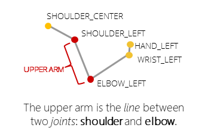

# Tutorial 5: Body depth data translated to Skeleton data

In this tutorial, you will process the depth information with the available libraries to calculate the skeleton joints of the bodies in the scene.

__Our goal:__ The goal of this tutorial is to understand the requirements to draw a skeleton from depth data such as the type of geometries used and the definition of data structures.

## Prerequisites

* You must have already followed the guide for installing and configuring the Kinect V2 [Link](https://github.com/violetasdev/bodytrackingdepth_course/wiki/Kinect-V2)

* You must have configured your Visual Studio 2019 correctly as instructed [Link](https://github.com/violetasdev/bodytrackingdepth_course/blob/master/KinectV2/docs/visualStudio2019_doc.md)

* You already know the general details of opening the camera. Check the [Tutorial 01](https://github.com/violetasdev/bodytrackingdepth_course/blob/master/KinectV2/docs/kinectTutorial01_doc.md) as this is the template we are following.

* You have finished tutorials 00 to 04. Especially __TUTORIAL 04__ Check the [Tutorials Documentation](https://github.com/violetasdev/bodytrackingdepth_course/blob/master/KinectV2/docs/) as this is the template we are following.

## Setting up the camera source variables

Before opening the camera, we need to understand the events and variables to calculate and show the skeleton joints.

__Important objects__: To handle the body frame data source, we will need:

- ___coordinateMapper___: is a helper that serves as a bridge between the depth data and the body drawing by translating which pixels from the depth data belongs to a bone or a joint represented by lines, ellipses, and rectangles. 
- ___drawingGroup___: as the skeleton is composed of several elements such as circles and lines, we need to use a new object to display our results over the bitmap. 

Now that we understand our goal and the main variables, let's start coding the solution:

1. Include the Kinect and event handle libraries in your source code:

```C#
...  
using System.ComponentModel;
 /// Kinect Libraries
using Microsoft.Kinect;
```

2. Now, we need to create a class containing the available frame types. We will add the __Body__ type to the list containing the ___Infrared, Color___ and ___Depth___ streams. This helps the program to identify which information it should display in the interface.

```C#
...

namespace kinectTutorial05
{
    public enum DisplayFrameType
    {
        Infrared,
        Color,
        Depth, 
        Body
    }

...
```

3. In the __class MainWindow__ from your code file, ___MainWindow.XAML.cs___, we need to add a notification property to the class to manage the Clic Button events. Once we press the button, we are selecting a different source type and changing __currentFrameDescription__, and we need to inform this to the program:

```C#
... 
public partial class MainWindow : Window, INotifyPropertyChanged
    {
```

4. The class code remains mostly the same as in previous tutorials. In this case, I added some comments to make clear what variables belong to each stream before declaring the body tracking code:

```C#
... 
 // Setup interface option selection
        private const DisplayFrameType DEFAULT_DISPLAYFRAMETYPE = DisplayFrameType.Depth;

        /// Kinect Sensor object
        private KinectSensor kinectSensor = null;

        // Object to write the image to show on the interface for DEPTH, COLOR and INFRARED sources
        private WriteableBitmap bitmap = null;
        private FrameDescription currentFrameDescription;
        private DisplayFrameType currentDisplayFrameType;
        // Reader to receive the information from the camera
        private MultiSourceFrameReader multiSourceFrameReader = null;


        // VARIABLES NEEDED FOR EACH FUNCTIONALITY //
        //***************** FOR INFRARED //
        /** Scale the values from 0 to 255 **/
        /// Setup the limits (post processing)of the infrared data that we will render.
        /// Increasing or decreasing this value sets a brightness "wall" either closer or further away.
        private const float InfraredOutputValueMinimum = 0.01f;
        private const float InfraredOutputValueMaximum = 1.0f;
        private const float InfraredSourceValueMaximum = ushort.MaxValue;
        /// Scale of Infrared source data
        private const float InfraredSourceScale = 0.75f;

        //***************** FOR DEPTH //
        /** Scale values for depth input**/
        /// Map depth range to byte range
        private const int MapDepthToByte = 8000 / 256;
        /// Intermediate storage for frame data converted to color
        private byte[] depthPixels = null;

...
```

5. To be able to show the skeleton information from the depth data, we need to __a) set up a limit in which the body will be detected in the "distance" from the camera.__ This is the range of the depth data: 

```C# 
  //***************** FOR BODY TRACKING //

        /// Control negative values of depth map: Constant for clamping Z values of camera space points
        private const float InferredZPositionClamp = 0.1f;
```

6. And __b) create the data structures to handle the body structure.__

For any data processing (depth or color) with the goal of acquiring a human body structure, we describe each __limb__ (parts of your body) such as ___legs___ and ___arms___, ___torso___ and ___hands___ as a __group of bones connected to each other__. We define a __bone__ as a "line between two joints", and a __joint__ as the single vertex of each bone. Joints are also identified as the points in which the body can flex as seen in the following picture:



We make collections of ___logically connected bones___ following the human body structure, and we describe this logic in a hierarchy or a tree. Hands can only be connected to arms and feet to legs, and so on. In total, there are 25 joints in the humana body and each one has a set of ___coordinates___ and ___orientation___. Once the structure is defined, we have the following human body arrangement:


7. To store the collection of bones, we create the following variables plus a list of colors to assign to each body as the Kinect V2 can detect up to six bodies. We will fill this list later in the code:


```C# 
 //** Variables for creating and storing bones coordinates
        /// Coordinate mapper to map one type of point to another from DEPTH to COLOR
        private CoordinateMapper coordinateMapper = null;
        /// list of bodies
        private Body[] bodies = null;
        /// definition of bones
        private List<Tuple<JointType, JointType>> bones;
        /// list of colors for each body tracked
        private List<Pen> bodyColors;
```

8. Secondly, we define the properties of the bones for each body such as the thickness, ends and colors. 

```C# 
//*** Variables for drawing the JOINTS (points of intersection between bones): 
        /// Thickness of drawn joint lines
        private const double JointThickness = 3;
        /// Thickness of clip edge rectangles
        private const double ClipBoundsThickness = 10;
        /// Brush for tracked joints
        private readonly Brush trackedJointBrush = new SolidColorBrush(Color.FromArgb(255, 68, 192, 68));
        /// Brush for inferred joints
        private readonly Brush inferredJointBrush = Brushes.Yellow;
        /// Pen for drawing inferred bones
        private readonly Pen inferredBonePen = new Pen(Brushes.Gray, 1);
```

9. The Kinect V2 is able to identify the gesture of your hand. In the code, we define variables to draw the hand and three different gestures. We will be able to distinguise when a hand is ___open, close___ or ___pointing___. To be able to differenciate them, we assign a color code to each status:

```C# 
  //** Variables for drawing the HANDS:
        /// Radius of drawn hand circles
        private const double HandSize = 20;
        /// Brush for closed hands
        private readonly Brush handClosedBrush = new SolidColorBrush(Color.FromArgb(128, 255, 0, 0));
        /// Brush for opened hands
        private readonly Brush handOpenBrush = new SolidColorBrush(Color.FromArgb(128, 0, 255, 0));
        /// Brush for pointed hands
        private readonly Brush handLassoBrush = new SolidColorBrush(Color.FromArgb(128, 0, 0, 255));
```

10. Lastly, we define the new interface object that will retrieve the collection of bones and joints. As this is a set of drawed geometries, we need to create a rendering object to display them according to the frame rate. We also declare the size of the window in which we will display the skeleton, which will be later fed with the depth map size. 

```C# 
 //** Variables for the Image object to import the results of the skeleton
        /// Drawing group for body rendering output
        private DrawingGroup drawingGroup;
        /// Drawing image that we will display
        private DrawingImage imageSource;
        /// Width of display (depth space)
        private int displayWidthBody;
        /// Height of display (depth space)
        private int displayHeightBody;
```

11. The body skeleton display is also a type of source frame in the Kinect. That is why we should additionally add the frameSourceType in the options for getting the selected information (this happens when we click the button on the UI):

```C# 
public MainWindow()
        {
            // Initialize the sensor
            this.kinectSensor = KinectSensor.GetDefault();

            // Open the reader for the  frames
            this.multiSourceFrameReader = this.kinectSensor.OpenMultiSourceFrameReader
                (FrameSourceTypes.Infrared
                | FrameSourceTypes.Color
                | FrameSourceTypes.Depth
                | FrameSourceTypes.Body);
```

12. We need to change what to __display__ in our interface according to the button pressed. Add the ___Body__ option to the previously created switch case (from Tutorial 04). In this one, additionally to the FrameDescription coming from the Depth information to define the size of the image displayed, we also initialize the bones __data structure__ and give color to each body detected. You will have two errors because we still haven't declared the methods __defineBoneParts()__ and __bodyIndexColors()__: 

```C# 

 private void SetupCurrentDisplay(DisplayFrameType newDisplayFrameType)
        {
            currentDisplayFrameType = newDisplayFrameType;

            switch (currentDisplayFrameType)

            {
                // Previous code from the other streams. Check Tutorial 04 for more info.
                (....)

                case DisplayFrameType.Body:
                    this.coordinateMapper = this.kinectSensor.CoordinateMapper;
                    FrameDescription bodyDepthFrameDescription = this.kinectSensor.DepthFrameSource.FrameDescription;
                    this.CurrentFrameDescription = bodyDepthFrameDescription;

                    // get size of the scene
                    this.displayWidthBody = bodyDepthFrameDescription.Width;
                    this.displayHeightBody = bodyDepthFrameDescription.Height;

                    // Define a bone as the line between two joints
                    this.bones = new List<Tuple<JointType, JointType>>();
                    // Create the body bones
                    this.defineBoneParts();

                    // Populate body colors that you wish to show, one for each BodyIndex:
                    this.bodyColors = new List<Pen>();
                    this.bodyIndexColors();

                    // We need to create a drawing group
                    this.drawingGroup = new DrawingGroup();
                   
                    break;

                default:
                    break;
            }
        }

```
13. The human body structure can be seen as a __torso__ with __arms__ and __legs__. These main structures are then composed of smaller parts connected to each other in a specific hierarchy. When we define the __boneParts()__ we are organizing this hierarchy and telling the algorithm which joint should be connected. This is very important, as we will see later, for drawing the lines of our bodies:

```C# 
/// <summary>
        /// Define which parts are connected between them
        /// </summary>
        private void defineBoneParts()
        {
            // Torso
            this.bones.Add(new Tuple<JointType, JointType>(JointType.Head, JointType.Neck));
            this.bones.Add(new Tuple<JointType, JointType>(JointType.Neck, JointType.SpineShoulder));
            this.bones.Add(new Tuple<JointType, JointType>(JointType.SpineShoulder, JointType.SpineMid));
            this.bones.Add(new Tuple<JointType, JointType>(JointType.SpineMid, JointType.SpineBase));
            this.bones.Add(new Tuple<JointType, JointType>(JointType.SpineShoulder, JointType.ShoulderRight));
            this.bones.Add(new Tuple<JointType, JointType>(JointType.SpineShoulder, JointType.ShoulderLeft));
            this.bones.Add(new Tuple<JointType, JointType>(JointType.SpineBase, JointType.HipRight));
            this.bones.Add(new Tuple<JointType, JointType>(JointType.SpineBase, JointType.HipLeft));

            // Right Arm
            this.bones.Add(new Tuple<JointType, JointType>(JointType.ShoulderRight, JointType.ElbowRight));
            this.bones.Add(new Tuple<JointType, JointType>(JointType.ElbowRight, JointType.WristRight));
            this.bones.Add(new Tuple<JointType, JointType>(JointType.WristRight, JointType.HandRight));
            this.bones.Add(new Tuple<JointType, JointType>(JointType.HandRight, JointType.HandTipRight));
            this.bones.Add(new Tuple<JointType, JointType>(JointType.WristRight, JointType.ThumbRight));

            // Left Arm
            this.bones.Add(new Tuple<JointType, JointType>(JointType.ShoulderLeft, JointType.ElbowLeft));
            this.bones.Add(new Tuple<JointType, JointType>(JointType.ElbowLeft, JointType.WristLeft));
            this.bones.Add(new Tuple<JointType, JointType>(JointType.WristLeft, JointType.HandLeft));
            this.bones.Add(new Tuple<JointType, JointType>(JointType.HandLeft, JointType.HandTipLeft));
            this.bones.Add(new Tuple<JointType, JointType>(JointType.WristLeft, JointType.ThumbLeft));

            // Right Leg
            this.bones.Add(new Tuple<JointType, JointType>(JointType.HipRight, JointType.KneeRight));
            this.bones.Add(new Tuple<JointType, JointType>(JointType.KneeRight, JointType.AnkleRight));
            this.bones.Add(new Tuple<JointType, JointType>(JointType.AnkleRight, JointType.FootRight));

            // Left Leg
            this.bones.Add(new Tuple<JointType, JointType>(JointType.HipLeft, JointType.KneeLeft));
            this.bones.Add(new Tuple<JointType, JointType>(JointType.KneeLeft, JointType.AnkleLeft));
            this.bones.Add(new Tuple<JointType, JointType>(JointType.AnkleLeft, JointType.FootLeft));

        }
```

Remember this hierarchy is based on:


14. As we did with the other frame sources, we create a method to be triggered by the __button click event__, which will start processing our BodyFrame data. At first, it will count how many bodies are in the scene and assign an identifier to each one of them. This helps the program to create the proper collection of bones. 

The goal of this method is __to identify where are the body joints located__. For each body detected, it selects an available color and starts creating the joints by assigning the coordinates. Once the joints exist, the algorithm can begin connecting them according to their hierarchy. The task of __coordinateMapper__ is to translate the pixel data retrieved from the depth data to a visible geometry, in this case, a line. Once a body is complete, it will evaluate the hand gesture. When all the bodies have the collection of bones, the bodies are transferred to the drawingGroup to be processed by the interface. 

```C# 
 private void ShowBodyFrame(BodyFrame bodyFrame)
        {
            bool dataReceived = false;
            if (bodyFrame != null)
            {

                if (this.bodies == null)
                {
                    this.bodies = new Body[bodyFrame.BodyCount];
                }

                // The first time GetAndRefreshBodyData is called, Kinect will allocate each Body in the array.
                // As long as those body objects are not disposed/eliminated and not set to null in the array,
                // those body objects will be re-used.
                bodyFrame.GetAndRefreshBodyData(this.bodies);
                dataReceived = true;
            }


            if (dataReceived)
            {
                using (DrawingContext dc = this.drawingGroup.Open())
                {
                    // Draw a transparent background to set the render size
                    dc.DrawRectangle(Brushes.DarkViolet, null, new Rect(0.0, 0.0, this.displayWidthBody, this.displayHeightBody));

                    int penIndex = 0;

                    //For each DETECTED body
                    foreach (Body body in this.bodies)
                    {
                        Pen drawPen = this.bodyColors[penIndex++];

                        if (body.IsTracked)
                        {
                            // CREATE JOINTS
                            this.DrawClippedEdges(body, dc);

                            IReadOnlyDictionary<JointType, Joint> joints = body.Joints;

                            // convert the joint points to depth (display) space
                            Dictionary<JointType, Point> jointPoints = new Dictionary<JointType, Point>();

                            foreach (JointType jointType in joints.Keys)
                            {
                                // sometimes the depth(Z) of an inferred joint may show as negative
                                // clamp down to 0.1f to prevent coordinatemapper from returning (-Infinity, -Infinity)
                                CameraSpacePoint position = joints[jointType].Position;

                                if (position.Z < 0)
                                {
                                    position.Z = InferredZPositionClamp;
                                }

                                DepthSpacePoint depthSpacePoint = this.coordinateMapper.MapCameraPointToDepthSpace(position);
                                jointPoints[jointType] = new Point(depthSpacePoint.X, depthSpacePoint.Y);
                            }

                            //DRAW THE LINES BETWEEN JOINTS
                            this.DrawBody(joints, jointPoints, dc, drawPen);
                            this.DrawHand(body.HandLeftState, jointPoints[JointType.HandLeft], dc);
                            this.DrawHand(body.HandRightState, jointPoints[JointType.HandRight], dc);
                        }
                    }

                    // Draw only in the area visible for the camera, this means it will be clipped to fit the interface
                    this.drawingGroup.ClipGeometry = new RectangleGeometry(new Rect(0.0, 0.0, this.displayWidthBody, this.displayHeightBody));
                }
                // Send to our UI/Interface the created bodies to display in the image:
                FrameDisplayImage.Source = new DrawingImage(this.drawingGroup);

            }
        }

```

15. The algorithm creates each joint according to the orientation, defining what is right or left:

```C# 
/// Draws indicators to show which edges are clipping body data
        private void DrawClippedEdges(Body body, DrawingContext drawingContext)
        {
            FrameEdges clippedEdges = body.ClippedEdges;

            if (clippedEdges.HasFlag(FrameEdges.Bottom))
            {
                drawingContext.DrawRectangle(
                    Brushes.Indigo,
                    null,
                    new Rect(0, this.displayHeightBody - ClipBoundsThickness, this.displayWidthBody, ClipBoundsThickness));
            }

            if (clippedEdges.HasFlag(FrameEdges.Top))
            {
                drawingContext.DrawRectangle(
                    Brushes.Indigo,
                    null,
                    new Rect(0, 0, this.displayWidthBody, ClipBoundsThickness));
            }

            if (clippedEdges.HasFlag(FrameEdges.Left))
            {
                drawingContext.DrawRectangle(
                    Brushes.Indigo,
                    null,
                    new Rect(0, 0, ClipBoundsThickness, this.displayHeightBody));
            }

            if (clippedEdges.HasFlag(FrameEdges.Right))
            {
                drawingContext.DrawRectangle(
                    Brushes.Indigo,
                    null,
                    new Rect(this.displayWidthBody - ClipBoundsThickness, 0, ClipBoundsThickness, this.displayHeightBody));
            }
        }


```

16. Now, let's have a closer look at the __DrawBody()__ method. It receives the information about the joints, the surface on which we will draw the body, and the color from the list of body colors. The bones tuple, by definition, knows that it needs to be composed by two joints . This method's main task is to make visible the coordinates we got from the coordinateMapper. When it is impossible to see the body entirely due to an occlusion: a table, other body, or the body orientation (side, back), the algorithm will infer the line to draw according to the hierarchy of the body human body and color code them so we can know when is tracked and when inferred.

```C# 
// ***************************************************************************//
        // ************************* BODY DATA PROCESSING **************************//

        /// Draws a body
        private void DrawBody(IReadOnlyDictionary<JointType, Joint> joints, IDictionary<JointType, Point> jointPoints, DrawingContext drawingContext, Pen drawingPen)
        {
            // Draw the bones
            foreach (var bone in this.bones)
            {
                this.DrawBone(joints, jointPoints, bone.Item1, bone.Item2, drawingContext, drawingPen);
            }

            // Draw the joints
            foreach (JointType jointType in joints.Keys)
            {
                Brush drawBrush = null;

                TrackingState trackingState = joints[jointType].TrackingState;

                if (trackingState == TrackingState.Tracked)
                {
                    drawBrush = this.trackedJointBrush;
                }
                else if (trackingState == TrackingState.Inferred)
                {
                    drawBrush = this.inferredJointBrush;
                }

                if (drawBrush != null)
                {
                    drawingContext.DrawEllipse(drawBrush, null, jointPoints[jointType], JointThickness, JointThickness);
                }
            }
        }
```

17. To draw a bone, the algorithm simply creates a line between the two received joints: 

```C# 
 /// Draws one bone of a body (joint to joint)
        private void DrawBone(IReadOnlyDictionary<JointType, Joint> joints, IDictionary<JointType, Point> jointPoints, JointType jointType0, JointType jointType1, DrawingContext drawingContext, Pen drawingPen)
        {
            // A bone results from the union of two joints/vertices
            Joint joint0 = joints[jointType0];
            Joint joint1 = joints[jointType1];

            // If we can't find either of these joints, we cannot draw them! Exit
            if (joint0.TrackingState == TrackingState.NotTracked ||
                joint1.TrackingState == TrackingState.NotTracked)
            {
                return;
            }

            // We assume all drawn bones are inferred unless BOTH joints are tracked
            Pen drawPen = this.inferredBonePen;
            if ((joint0.TrackingState == TrackingState.Tracked) && (joint1.TrackingState == TrackingState.Tracked))
            {
                drawPen = drawingPen;
            }

            drawingContext.DrawLine(drawPen, jointPoints[jointType0], jointPoints[jointType1]);
        }
```

18. As we want to differentiate hand gestures, we evaluate the state calculated by the algorithm and assign a color and a size to draw an ellipse:

```C# 
// Draws a hand symbol if the hand is tracked: red circle = closed, green circle = opened; blue circle = lasso ergo pointing
        private void DrawHand(HandState handState, Point handPosition, DrawingContext drawingContext)
        {
            switch (handState)
            {
                case HandState.Closed:
                    drawingContext.DrawEllipse(this.handClosedBrush, null, handPosition, HandSize, HandSize);
                    break;

                case HandState.Open:
                    drawingContext.DrawEllipse(this.handOpenBrush, null, handPosition, HandSize, HandSize);
                    break;

                case HandState.Lasso:
                    drawingContext.DrawEllipse(this.handLassoBrush, null, handPosition, HandSize, HandSize);
                    break;
            }
        }

```

19. Here we find the color setup for the bodies that was used for the algorithm in earlier steps. We add six colors to the __bodyColors__ object as we want to make the skeletons look different according to the assigned Body ID. 

```C# 
        /// These colors are for the bodies detected by the camera. For the Kinect V2, a maximum of 6
        private void bodyIndexColors()
        {

            this.bodyColors.Add(new Pen(Brushes.Red, 6));
            this.bodyColors.Add(new Pen(Brushes.Orange, 6));
            this.bodyColors.Add(new Pen(Brushes.Green, 6));
            this.bodyColors.Add(new Pen(Brushes.Blue, 6));
            this.bodyColors.Add(new Pen(Brushes.Indigo, 6));
            this.bodyColors.Add(new Pen(Brushes.Violet, 6));

        }
```

20. Now that we have the main logic configured, we modify the interface to show the image and the buttons to select the frame source we want to display. Open your interface file by clicking in ___MainWindow.XAML.cs___. You will see a window with the XAML code definition below. XAML is a markup language, so you need to properly close the tags to make it work. 


21. Open from the __View__ menu the __Toolbox__:


22. In the Toolbox, you will see different controls that can be added to the interface (in our case, a Window). First, look for the Buttons and add a new one to the interface for the __Skeleton View__.


23. You can change the text of each button by selecting the button and changing the name in the XML code in the __Content__ property. 


24. Next, we will add the click event to the button. By double-clicking on it, you will be redirected to the ___MainWindow.XAML.cs___ file. We want to trigger the event of __Show...__ depending on each button. Pay attention to the name of your button and to the method you are adding! They must correspond.

``` C#
        . . .

        private void Button_Body(object sender, RoutedEventArgs e)
        {
            SetupCurrentDisplay(DisplayFrameType.Body);
        }
```

25. Return to your XAML designer. Play around with the buttons, color, effects and titles. Your final code should look similar to:

```XML
<Window x:Class="kinectTutorial05.MainWindow"
        xmlns="http://schemas.microsoft.com/winfx/2006/xaml/presentation"
        xmlns:x="http://schemas.microsoft.com/winfx/2006/xaml"
        xmlns:d="http://schemas.microsoft.com/expression/blend/2008"
        xmlns:mc="http://schemas.openxmlformats.org/markup-compatibility/2006"
        xmlns:local="clr-namespace:kinectTutorial05"
        mc:Ignorable="d"
                Title="Tutorial 05" Height="512" Width="789" Background="White">
    <Grid Margin="10,0,10,79">
        <Grid.RowDefinitions>
            <RowDefinition Height="Auto" />
            <RowDefinition Height="*" />
            <RowDefinition Height="Auto" />
            <RowDefinition Height="Auto" />
        </Grid.RowDefinitions>
        <TextBlock Grid.Row="0" Margin="0 0 -1 0" HorizontalAlignment="Left" VerticalAlignment="Bottom" FontFamily="Segoe UI" FontSize="14">Click a button to change the source!</TextBlock>
        <Viewbox Grid.Row="1" HorizontalAlignment="Center">
            <Image x:Name="FrameDisplayImage" Stretch="UniformToFill" />
        </Viewbox>
        <ScrollViewer Grid.Row="3" 
            ScrollViewer.HorizontalScrollBarVisibility="Auto" 
            ScrollViewer.VerticalScrollBarVisibility="Auto" Margin="22,24,22,-62">
            <StackPanel Orientation="Horizontal">
                <Button Content="Infrared" Padding="5" Margin="250,5,5,5" Click="Button_Infrared" Background="#FFCBCBCB" />
                <Button Content="Color" Padding="5" UseLayoutRounding="True" Margin="5" Click="Button_Color" />
                <Button Content="Depth" Padding="5" UseLayoutRounding="True" Margin="5" Click="Button_Depth" />
                <Button Content="Skeleton View" Padding="5" UseLayoutRounding="True" Margin="5" Click="Button_Body" />
            </StackPanel>
        </ScrollViewer>
    </Grid>
</Window>
```

26. Run your code. You can see the interface with the new ___Skeleton View___ button. Take some distance from the camera as it needs to first view your body to start calculating the bones and joints. And now you can see your skeleton moving around!


27. Congratulations! You finished Tutorial 05. Check the complete source code in the repository for a comprehensive overview [Link](https://github.com/violetasdev/bodytrackingdepth_course/tree/master/KinectV2/kinectTutorial05)