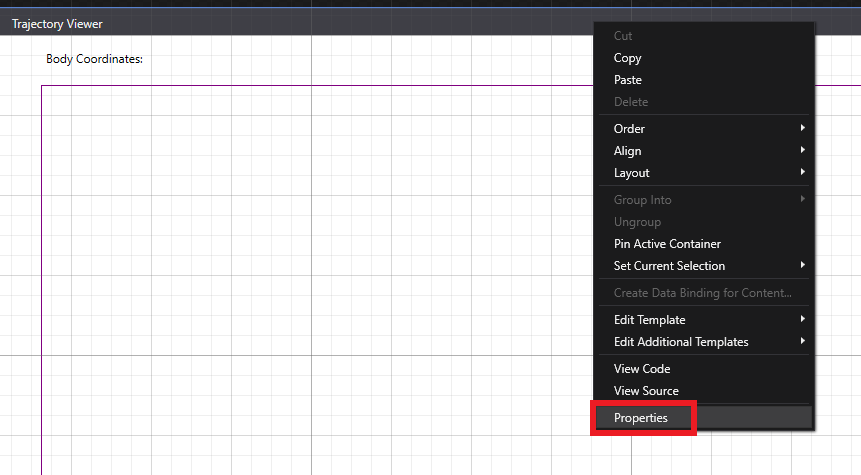
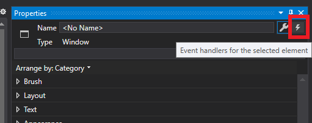

# Tutorial 6: Trajectory viewer

In this tutorial, you will process the coordinate data from the skeleton joints to draw the body's traveled trajectory in front of the camera. 

__Our goal:__ The purpose of this tutorial is to recognize the camera's field of view and make practical use of the skeleton joints to identify trajectories.

## Prerequisites

* You must have already followed the guide for installing and configuring the Kinect V2 [Link](https://github.com/violetasdev/bodytrackingdepth_course/wiki/Kinect-V2)

* You must have configured your Visual Studio 2019 correctly as instructed [Link](https://github.com/violetasdev/bodytrackingdepth_course/blob/master/KinectV2/docs/visualStudio2019_doc.md)

* You already know the general details of opening the camera. Check the [Tutorial 01](https://github.com/violetasdev/bodytrackingdepth_course/blob/master/KinectV2/docs/kinectTutorial01_doc.md) as this is the template we are following.

* You have finished tutorials 00 to 05. Especially __TUTORIAL 05__ Check the [Tutorials Documentation](https://github.com/violetasdev/bodytrackingdepth_course/blob/master/KinectV2/docs/) as this one contains information about the Skeleton Data.

## Setting up the variables

Before opening the camera, we need to understand the events and variables to calculate coordinates:

__Important objects__: To handle the body frame data source, we will need:

- ___drawingGroup___: as the trajectory is composed of several elements such as circles and pixels, we need to use a new object to display our results over the bitmap.

- ___Canvas___: is a layout from the XAML designer that allows us to draw and update geometries. 

Now that we understand our goal and the main variables, let's start coding the solution:

1. As always, first, we include the Kinect and event handle libraries in your source code:

```C#
...  
 /// Kinect Libraries
using Microsoft.Kinect;
```

2. As we will be using only the ___body___ frame source, we don't need to specify any display frame types.

3. In the __class MainWindow__ from your code file, ___MainWindow.XAML.cs___, we DO NOT need a notifier, so this time is the default configuration:

```C#
... 
public partial class MainWindow : Window
    {
         /// Kinect Sensor object
        private KinectSensor kinectSensor = null;

        //**// Object to write the image to show on the interface the results of the trajectory
        /// Drawing group for body rendering output
        private DrawingGroup drawingGroup;
        /// Drawing image that we will display
        private DrawingImage imageSource;

        // Reader to receive the information from the camera
        private MultiSourceFrameReader multiSourceFrameReader = null;
```

4. This time, the class code will be more straightforward. We need to collect the bodies in front of the camera and define some graphics to draw the information:

```C#
... 
  //***************** FOR TRAJECTORIES //

        /// Array for the bodies
        private Body[] bodies = null;
        ulong[] bodies_ids = { 0, 0, 0, 0, 0, 0 };


        //Data for each body
        List<Brush> bodyBrushes = new List<Brush>();
        public double dperPixZ = 0;
        public double dperPixX = 0;

...
```

5. The body frame source type is directly set as an argument for the __multiSourceFrameReader__ as we do not need additional sources. We also create the __imageSource__ object that will be displayed in the Window:

```C# 
public MainWindow()
        {
            // Initialize the sensor
            this.kinectSensor = KinectSensor.GetDefault();

            // Create the drawing group we'll use for drawing as we have a set of geometries to insert
            this.drawingGroup = new DrawingGroup();
            // Create an image source that we can use in our image control
            this.imageSource = new DrawingImage(this.drawingGroup);

            // Object with the information
            this.DataContext = this;

            // Get body information from the sensor
            this.multiSourceFrameReader = this.kinectSensor.OpenMultiSourceFrameReader(FrameSourceTypes.Body);
            this.multiSourceFrameReader.MultiSourceFrameArrived += this.Reader_MultiSourceFrameArrived;

            //Create the colors to identify each person
            this.bodyIndexColors();
            // open the sensor
            this.kinectSensor.Open();

            InitializeComponent();
        }

        public ImageSource ImageSource
        {
            get
            {
                return this.imageSource;
            }
        }
```

6. As we want to clearly distinguish each body in the scene, as we did with the skeletons in Tutorial 5, let's add some colors: 

```C# 

// Colors for the positional ellipses
        private void bodyIndexColors()
        {

            this.bodyBrushes.Add(Brushes.Red);
            this.bodyBrushes.Add(Brushes.Black);
            this.bodyBrushes.Add(Brushes.Green);
            this.bodyBrushes.Add(Brushes.Blue);
            this.bodyBrushes.Add(Brushes.Indigo);
            this.bodyBrushes.Add(Brushes.Violet);

        }

```
7. Now that we have the colors, let's define the representation of the bodies in the scene. We will use the __ellipse__ constructor, simply drawing circles and adding them to the canvas we created previously. It will take as argument the body's coordinates in the scene:

```C# 
        //Create each ellipse (circle) used to show the position of the person in the camera's field of view
        private Ellipse createBody(double coord_x, double coord_y, Brush brush)
        {
            Ellipse ellipse = new Ellipse();
            ellipse.Fill = brush;
            ellipse.Width = 15;
            ellipse.Height = 15;
            this.fieldOfView.Children.Add(ellipse);
            Canvas.SetLeft(ellipse, coord_x);
            Canvas.SetTop(ellipse, fieldOfView.ActualHeight - coord_y);
            return ellipse;
        }

```

8. As we did in another tutorial, we define the events triggered when the body frame source comes from the camera. In general, is very similar to previous tutorials. 

Once we retrieve the body data, we count how many bodies are in the scene and define a __tracking__ status. We draw a trace in circles of a 1-pixel size showing where the body has been moving with this information. Finally, the code adds the detected participants in the scene. 

```C# 
        private void Reader_MultiSourceFrameArrived(object sender, MultiSourceFrameArrivedEventArgs e)
        {
            var reference = e.FrameReference.AcquireFrame();

            using (var bodyFrame = reference.BodyFrameReference.AcquireFrame())
            {
                if (bodyFrame != null)
                {

                    //Get the number the bodies in the scene
                    bodies = new Body[bodyFrame.BodyFrameSource.BodyCount];

                    bodyFrame.GetAndRefreshBodyData(bodies);

                    List<Body> tracked_bodies = bodies.Where(body => body.IsTracked == true).ToList();
                    
                    // Here we draw the path travelled during the session with pixel size traces
                    var moves = fieldOfView.Children.OfType<Ellipse>().ToList();
                    foreach (Ellipse ellipse in moves)
                    {
                        ellipse.Width = 1;
                        ellipse.Height = 1;
                    }

                    // Check if there are bodies changing in the scene
                    UpdateTracked_Bodies(tracked_bodies);

                }
            }
        }

```

9. Before creating any new bodies, we must verify if there are previously detected bodies in the scene. The Kinect V2 can detect up to 6 bodies in the background. The variable __dperPixZ__ contains the actual pixel distance in terms of the size of the field of view to scale the coordinates coming from the depth map. This allows us to draw the information in a 2D plane. 

___Remember___ we use the value of Z as it is the value of the depth in respect to the camera. We always draw the information as we were looking from the top. The Kinect V2 possesses its own coordinate system, as displayed in the next image:


```C#
private void DrawTracked_Bodies(List<Body> tracked_bodies)
        {
            for (int last_id = 0; last_id < 6; last_id++)
            {
                if (bodies_ids[last_id] == 0)
                    continue;

                bool is_tracked = false;

                for (int new_id = 0; new_id < tracked_bodies.Count; new_id++)
                {
                    if (tracked_bodies[new_id].TrackingId == bodies_ids[last_id])
                    {
                        is_tracked = true;
                        break;
                    }
                }

                if (!is_tracked)
                {
                    bodies_ids[last_id] = 0;
                }
            }

            // Check if someone new entered the scene
            for (int new_id = 0; new_id < tracked_bodies.Count; new_id++)
            {
                dperPixZ = (double)fieldOfView.ActualHeight / 5000;
                double bodyX = tracked_bodies[new_id].Joints[JointType.SpineMid].Position.X * dperPixZ * 1000 * (-1);
                double bodyZ = tracked_bodies[new_id].Joints[JointType.SpineMid].Position.Z * dperPixZ * 1000;

                ulong current_id = tracked_bodies[new_id].TrackingId;

                // true: if body was previosly tracked
                // false: if its a new body just entered the scene
                bool is_tracked = false;

```

10. We verify the use of body identifiers and create the bodies. Additionally, we update the label in our interface to see the values of the coordinates __x__ and __y__ in a Cartesian Plane. 

```C# 
 // First check previously tracked bodies
                for (int exist_id = 0; exist_id < 6; exist_id++)
                {
                    if (bodies_ids[exist_id] == current_id)
                    {
                        is_tracked = true;
                        createBody(fieldOfView.ActualWidth / 2 + bodyX, bodyZ, bodyBrushes[exist_id]);
                        coord_body.Content = coordinatesFieldofView(tracked_bodies[exist_id]);
                        break;
                    }
                }

                // If not previously tracked, then fill the first empty spot in the list of tracking bodies
                if (!is_tracked)
                {
                    for (int fill_id = 0; fill_id < 6; fill_id++)
                    {
                        if (bodies_ids[fill_id] == 0)
                        {
                            bodies_ids[fill_id] = current_id;

                            createBody(fieldOfView.ActualWidth / 2 + bodyX, bodyZ, bodyBrushes[fill_id]);
                            coord_body.Content = coordinatesFieldofView(tracked_bodies[new_id]);

                            break;
                        }
                    }
                }
            }
        }
```

11. And from where do we get the coordinates? These are taken from the body joints. You can think about using any coordinates: if you want to track the hands, you will use the wrist_joints if you're going to follow the head, the upper body joints. As we are interested in the body's position in general, the joint that describes the available location of our bodies is the __spineMid Joint__.

```C# 
         private string coordinatesFieldofView(Body current_body)
        {

            //From the Skeleton Joints we use as position the SpineMid coordinates
            // Remember that Z represents the depth and thus from the perspective of a Cartesian plane it represents Y from a top view
            double coord_x = Math.Round(current_body.Joints[JointType.SpineMid].Position.Z, 2);
            // Remember that X represents side to side movement. The center of the camera marks origin (0,0). 
            // As the Kinect is mirrored we multiple by times -1
            double coord_y = Math.Round(current_body.Joints[JointType.SpineMid].Position.X, 2) * (-1);

            return "Body Coordinates: X: " + coord_x + " Y: " + coord_y;
        }
```

12. Lastly, we want to draw all the elements as soon as the application is live. For that, we use one event from the window designer who does not need the notifier library. Open your interface file by clicking in ___MainWindow.XAML.cs___. You will see a window with the XAML code definition below. XAML is a markup language, so you need to properly close the tags to make it work. 


13. Modify your code to include a border containing the canvas in which we will draw the geometrical elements:

```C# 
<Window x:Class="kinectTutorial06.MainWindow"
        xmlns="http://schemas.microsoft.com/winfx/2006/xaml/presentation"
        xmlns:x="http://schemas.microsoft.com/winfx/2006/xaml"
        xmlns:d="http://schemas.microsoft.com/expression/blend/2008"
        xmlns:mc="http://schemas.openxmlformats.org/markup-compatibility/2006"
        xmlns:local="clr-namespace:kinectTutorial06"
        mc:Ignorable="d"
        Title="Trajectory Viewer" Height="800" Width="1200" Loaded="Window_Loaded">
    <Grid x:Name="myGrid">
        <Border BorderBrush="Purple" BorderThickness="1" Margin="50,50,50,50" >
            <Canvas x:Name="fieldOfView">
            </Canvas>
        </Border>
    </Grid>
</Window>
```
14. Right click on the __Main Window__ in the designer and access to the object Events:




15. The event we need to use is __Loaded__. As soon as the window is ready, we will create our canvas and start tracking the bodies. To access the event. Simple do double click on the empty text box.


16. Clicking the event text box will retake us to the __MainWindow.XAML.cs__. You will notice the program has created the method __Window__Loaded__. In this method, we draw the Field of View of the camera. The Kinect V2 has a 70° open field of view horizontally. 

```C#
 private void Window_Loaded(object sender, RoutedEventArgs e)
        {
            // Draw Kinect Vision Area based on the size of our canvas
            int canvasHeight = (int)fieldOfView.ActualHeight;
            int canvasWidth = (int)fieldOfView.ActualWidth;
            
            PointCollection myPointCollection = new PointCollection();

            //The Kinect has a horizontal field of view opened by 70°, ergo we evaluate a triangle containing one of these angles
            // 35° to each side from the origin
            
            int x = Convert.ToInt16((canvasHeight * Math.Sin(Math.PI / 180) * 35) + canvasWidth / 2);
            int x1 = Convert.ToInt16(canvasWidth / 2 - (canvasHeight * Math.Sin(Math.PI / 180) * 35));

            // 3 Verticed for the field of view
            myPointCollection.Add(new Point(x, canvasWidth/2));
            myPointCollection.Add(new Point(x1, canvasWidth/2));
            myPointCollection.Add(new Point(canvasWidth/2, canvasHeight));

            //Creating the triangle from the 3 vertices

            Polygon myPolygon = new Polygon();
            myPolygon.Points = myPointCollection;
            myPolygon.Fill = Brushes.Purple;
            myPolygon.Width = canvasWidth;
            myPolygon.Height = canvasHeight;
            myPolygon.Stretch = Stretch.Fill;
            myPolygon.Stroke = Brushes.Purple;
            myPolygon.StrokeThickness = 1;
            myPolygon.Opacity = 0.2;

            //Add the triangle in our canvas
            myGrid.Children.Add(myPolygon);
        }
```
17. We need to add a new __Label__ to be updated with the content of the __Body Coordinates__. Open from the __View__ menu the __Toolbox__:


18. In the Toolbox, you will see different controls that can be added to the interface (in our case, a Window). Search for a Label add a new one to the interface.


19. You can change the label's text by selecting the tag and changing the name in the XAML code in the __Content__ property. __BE CAREFUL WITH THE NAME!__ It needs to be referenced as a variable to be accessed by the code when updating the coordinates. 


20. Play around with the buttons, color, effects and titles. Your final code should look similar to:

```XML
<Window x:Class="kinectTutorial06.MainWindow"
        xmlns="http://schemas.microsoft.com/winfx/2006/xaml/presentation"
        xmlns:x="http://schemas.microsoft.com/winfx/2006/xaml"
        xmlns:d="http://schemas.microsoft.com/expression/blend/2008"
        xmlns:mc="http://schemas.openxmlformats.org/markup-compatibility/2006"
        xmlns:local="clr-namespace:kinectTutorial06"
        mc:Ignorable="d"
        Title="Trajectory Viewer" Height="800" Width="1200" Loaded="Window_Loaded">
    <Grid x:Name="myGrid">
        <Border BorderBrush="Purple" BorderThickness="1" Margin="50,50,50,50" >
            <Canvas x:Name="fieldOfView">
            </Canvas>
        </Border>
        <Label  x:Name="coord_body" Content="Body Coordinates: " HorizontalAlignment="Left" Margin="50,10,0,0" VerticalAlignment="Top" Width="270"/>
    </Grid>
</Window>
```

21. Run your code. You can see the interface with the field of view. Take some distance from the camera as it needs to first view your body to start calculating the bones and joints. And now you can see a circle moving precisely as you are moving! The trace in the trajectory you have traveled in front of the camera.


22. As an additional exercise, consider how you can display more than 1 body? Also, it would be nice to add, for example, the color view to know where you are moving as an additional image on top of the trajectory viewer. Try to add a Color Frame Source additionally to this example.

__Tip__: We already have here the multiSourceFrameReader. Follow Tutorial number 5 to add your additional windows!

23. Congratulations! You finished Tutorial 06. Check the complete source code in the repository for a comprehensive overview [Link](https://github.com/violetasdev/bodytrackingdepth_course/tree/master/KinectV2/kinectTutorial06)