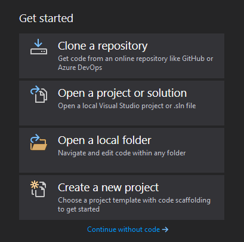
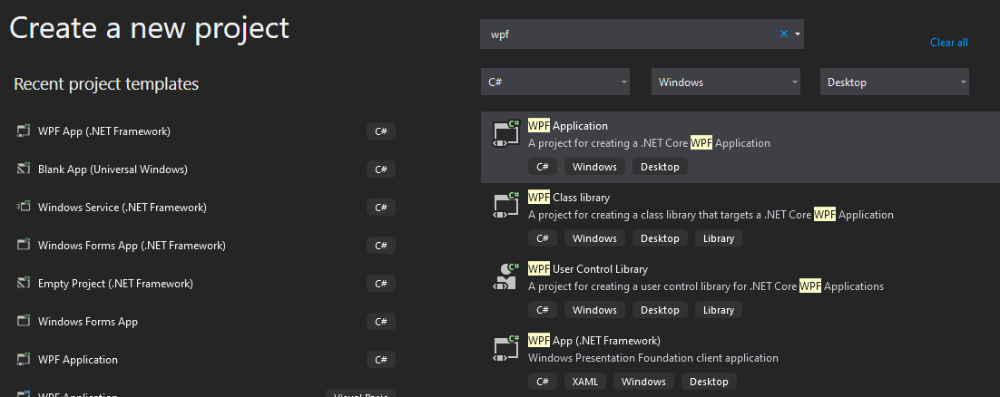
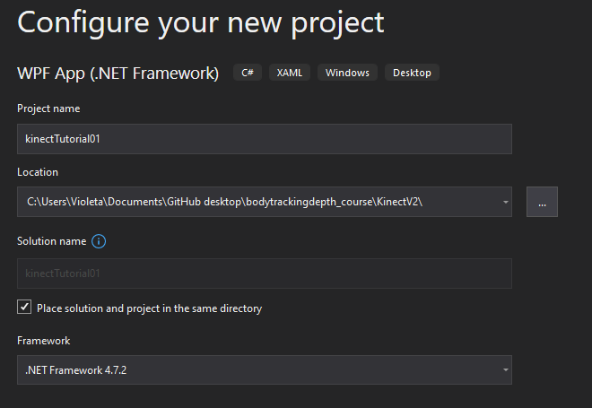
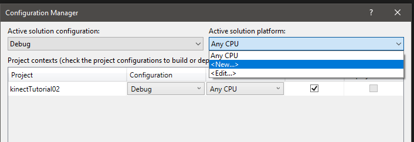
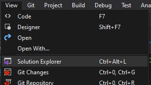
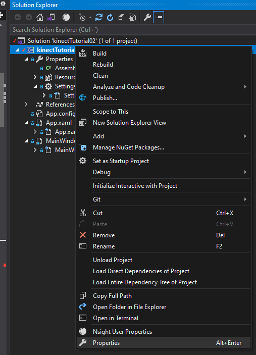
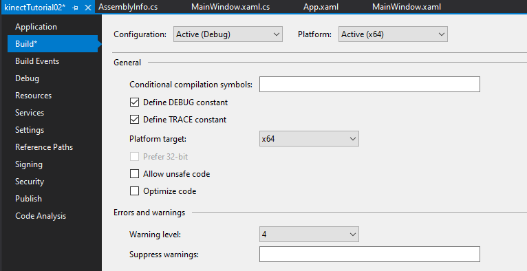
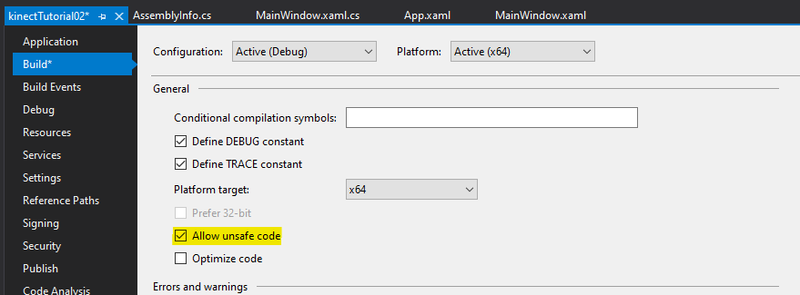

# Visual Studio 2019 Configuration for Kinect V2 code development

In this tutorial, you will find the instructions for configuring your Visual Studio 2019 to write code for the Kinect V2
## Prerequisites:
- At least 15 GB of free space on disk
- Internet connection to download the installer

## Installation Steps:

1. Download the Visual Studio 2019 installer from the Microsoft website [Link]
2. Execute the installer
3. Select the __.NET development environment__ as well the __C++ development__ environment as showed in the picture in your __Visual Studio Installer__. It will take more or less 10GB or disk. 
4. Restart your computer
5. All done!

## Creating a WPF (Windows Presentation Foundation) project

1. Open your Visual Studio 2019
2. Select the option __Create new poject__

3. Search for __WPF__
4. Select the option __WPF (.NET Framework)__

5. Give a name to your project
6. Ideally, create the project in the folder with your Github projects (because you are a good developer who will commit the changes to your own repository ;) )
7. Select the option __Place solution and project in the same folder__

8. Click on Create
9. Now you have ready your template to work

## Configuring the WPF project for Kinect V2 code
For running the application using the Microsoft Kinect library, you will need to run the Build in a x64 architecture and in some cases, your code needs to be run in ___unsafe___ mode.

### Configuring for __x64__ build
1. Open the __Configuration Manager__. Go to __Build__ in the context menu, and select __Configuration Manager__

2. In __Active solution plataform__ open the scroll menu and select __<New...>__

3. It should pop up the __x64__ text automatically, if not, just select it or write it down.

4. Click on __OK__
5. Click on __Close__

---
### Configuring __unsafe__ code
1. Open the __Solution Explorer__. Go to __View__ in the context menu, and select __Solution Explorer__

2. Right click on your project name, and select __Properties__

3. On the left menu, select __Build__

4. From the options, check __Allow unsafe code__

5. Save with Ctrl+S or click on the Save icon.

